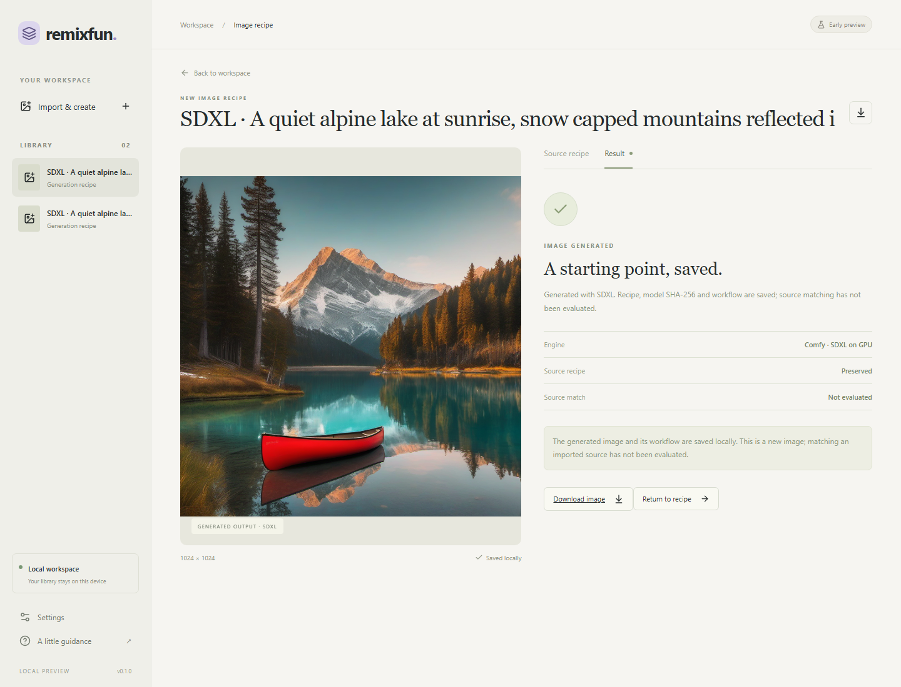

# Local SDXL generation

Date: 2026-09-12. Windows, NVIDIA RTX 4090, source service and browser UI.
This proves that Remixfun can create a new image on the GPU. It does not prove
reproduction of Civitai image 141984808; its recipe was not acquired here.

## Runtime and model

- Comfy v0.35.0, commit `40c4fcdf513a4523e39d54a9d391908af8df8171`.
- Python 3.12.11, PyTorch `2.14.0+cu130`; installed dependencies pass
  `uv pip check` and are recorded in the [profile](../../runtime-profiles/README.md).
- SDXL Base 1.0, Hugging Face revision
  `462165984030d82259a11f4367a4eed129e94a7b`.
- Checkpoint SHA-256
  `31e35c80fc4829d14f90153f4c74cd59c90b779f6afe05a74cd6120b893f7e5b`.
- Core-node graph, Euler / normal, seed 42, 25 steps, CFG 7, 1024 x 1024,
  batch size one, checkpoint VAE, empty negative prompt, no LoRA.

The prompt describes a quiet alpine lake, snowy mountains, sunrise, pine trees
and a red canoe. It is an authored test prompt, not recovered source metadata.
Model size and SHA-256 were checked after download and again before runtime use.
Comfy loaded in an isolated ignored directory, not the research checkout.

## Observed result

`node scripts/verify_gpu.mjs` opened Remixfun, created the recipe, clicked
**Generate image**, waited for the actual Comfy job, downloaded the PNG, captured
the result view, reloaded the browser and reopened the saved result.

The first job `c3c392c4-816b-414c-bb92-0292e3907324` completed; Comfy reported
7.99 seconds of execution, including sampling and VAE decoding. The output is
1024 x 1024 PNG, 1,797,406 bytes, SHA-256
`99f1d9dad09856d9247b74d1f70878e6bcfcf9ba05c02335b1baac82bdc3ce06`.
Its [saved job](local-sdxl/job.json) includes graph, recipe and runtime identity.

A second browser run after UI changes reopened the same-settings output.
Comfy reported 0.00 seconds for that cached graph. This is cache/reopen evidence,
not an independent GPU repeatability run. No pixel-equality reproduction claim
is made. The screenshot reflects this second run with the same output bytes.

[Download the generated image](local-sdxl/generated.png).

## Checks and limits

74 CPU/backend tests, five ordinary Playwright tests, the source service/CLI
smoke, frontend build and runtime dependency checks pass. The CPU engine tests
cover saved graphs/outputs, 64-bit seeds, hash mismatch, rejected model
substitution, output dimension mismatch, uncertain outcomes and shutdown/recovery transitions. They are
separate from the real GPU evidence above.

The service's GPU stop/restart verification command was rejected by automatic
approval review with "blocked by policy". It was not executed or retried through
another route. The verification service remains running; real GPU service
restart/close acceptance is pending. Browser reload and SQLite persistence were
observed. Source service/CLI restart smoke uses no GPU. The final CUDA startup
guard, output dimension check and unknown-job recovery adjustment have
CPU/static verification; the already-running GPU service predates these changes.

The initial frozen desktop payload has not been rebuilt or configured with the
runtime. Use the source-service setup linked above. Imported-source model
resolution, Civitai reproduction, LoRAs, batch recovery, arbitrary workflow
execution, remixing, animation, signed installers and publication remain open.
