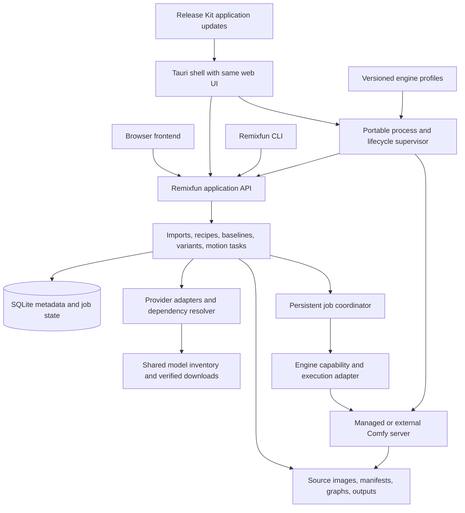

# Proposed Remixfun architecture

**Status: supporting design, not implemented.** The [current product/build plan](../PLAN.md) takes precedence and adds the user's opinionated UI scope, batch-position recovery, explicit network behavior, and joint Dreamtime/Comfy modernization. This design follows the [landscape survey](LANDSCAPE.md) and [Dreamtime extraction assessment](DREAMTIME-COMPARISON.md).

## 1. One application service, optional desktop shell

The desktop shell owns native dialogs, file associations/deep links if added, lifecycle, notifications, and application updates. It should not be the only location where a recipe can be resolved or a job created. The same task should work with the desktop shell closed if the service was intentionally started in server mode.

A Python application service is the lowest-change starting point because Dreamtime already uses FastAPI/Pydantic and Python graph adapters. Rust can supervise processes and expose native capabilities without rewriting the domain/backend. The static React build can be served by the service or packaged in Tauri, provided API discovery and session handling remain explicit.

## 2. Records should preserve evidence rather than overwrite it

| Object | Purpose | Important fields |
|---|---|---|
| Source artifact | Preserve what was imported | Original bytes/hash, source URL/ID, acquisition time, raw metadata/responses |
| Recipe record | Normalize available generation facts | Prompt, dimensions, seed, stages, resources, per-field provenance, unread fields |
| Dependency plan | Explain how requirements can be satisfied | Version/file/hash identities, installed matches, missing files, substitutions, required nodes |
| Runtime profile | Describe executable environment | OS/arch/backend, engine commit, Python/Torch, node versions, precision/attention settings |
| Replay manifest | Freeze an attempted baseline | Recipe version, resolved files, graph/template version, input hashes, runtime profile |
| Run | Track execution and observations | Job/prompt IDs, state, logs, submitted graph, output hashes, timings, repeatability result |
| Variant | Describe controlled changes | Parent manifest/run, typed parameter diff, declared axes, chosen values |
| Motion task | Animate a selected artifact | Exact source image hash, preset/version, start/end inputs, segment settings, output lineage |

These are proposed entities, not a claim about existing Dreamtime tables. A single imported image may have several attempted replay manifests as missing information is resolved. Its original source evidence should remain unchanged.

Do not collapse all status into one reproduction score. Useful observations include: metadata complete/incomplete; dependencies exact/substituted/unresolved; graph accepted/rejected; repeatable/not tested; source match exact/close/different/unassessed. A valid graph can still be an approximation.

## 3. Model library: physical files and recipe references

Maintain a single inventory of model blobs with observed content hashes, sizes, locations, provider identities, and verification evidence. A recipe references identities; an engine adapter maps those identities to its expected filenames/paths.

Index external Comfy libraries without forcing a copy. For managed files, stream into a temporary location, resume only when remote identity permits, verify expected hashes when available, then promote atomically. Record when verification is limited to a partial hash or no expected digest is available.

Separate download progress from “installed and compatible.” A valid safetensors file may still be the wrong architecture, precision, or component. A checkpoint version alone may not include the required VAE/text encoder. Model selection should therefore produce a dependency plan before execution.

A cache policy should preserve files referenced by saved experiments unless the user deliberately removes them. Deleting an unreferenced temporary preview is different from deleting the only copy of a model needed to replay an old baseline.

## 4. Versioned presets, not arbitrary workflow promises

Each supported preset should contain:

- identity, version, source attribution, and intended task;
- a typed input schema and meaningful UI labels;
- graph template/compiler version;
- exact or constrained model/node requirements;
- output types and metadata rules;
- capabilities such as first-frame, last-frame, extension, or loop;
- supported runtime profiles and measured hardware results;
- a validation fixture and known limitations.

Keep node-specific bindings behind a preset adapter. Comfy App Mode, ViewComfy, SDFX, and Visionatrix demonstrate generic mappings, but Remixfun can start with a smaller task-focused schema. A model name containing “video” is insufficient to enable every motion control.

For foreign imports, a translator can produce a candidate preset/graph, but every inferred stage must be recorded. Unknown stages remain unknown. Importing a full graph should preserve that graph as evidence even if Remixfun cannot safely expose every control or install every dependency.

## 5. Deterministic experiments have two separate questions

First: can the application repeat its own baseline in a fixed supported environment? Second: does that baseline recreate the imported source? The first can pass while the second fails because source metadata omitted something.

For repeatability, freeze model bytes, graph, inputs, seed, execution settings, and runtime profile. A variant changes only its declared fields. Validate the resulting diff before queueing. Preserve the actual submitted graph, since UI state may not reflect every effective default.

For source matching, compare decoded pixels when possible, along with visual review and separate similarity measures. Encoded PNG/video bytes can change because of metadata or codecs even when image content is unchanged. Visual similarity is not proof of identical provenance. Cross-device equality should be a measured result, not a default guarantee; see [PyTorch's reproducibility guidance](https://docs.pytorch.org/docs/2.14/notes/randomness.html).

## 6. Jobs and engine ownership

The job coordinator should persist before submission, correlate with the engine's accepted prompt ID, and reconcile after connection loss/restart. Do not automatically requeue a job whose execution status is unknown. Download jobs and generation jobs also need different concurrency limits.

Prefer one managed Comfy instance per selected runtime profile initially. It can share model storage with other instances while keeping dependencies isolated. Support an external Comfy server as an advanced path, with a capability check and clear ownership/cancellation behavior.

The application API should use local binding/session controls by default. Remote serving is a separate intentional mode. Imported metadata is data, not permission to execute arbitrary installation commands; a curated model/node acquisition plan should mediate executable dependencies. These are ordinary product boundaries for a local process-managing app.

## 7. Three update lifecycles

| Updated thing | Versioning/rollback | Why separate |
|---|---|---|
| Remixfun UI/native/application code | Release Kit signed app releases and channels | Ordinary UI fixes should not redownload models or mutate old experiments |
| Engine profile and node environment | Explicit profile version; install alongside/rollback | New Torch/Comfy/node versions can change compatibility or numerical output |
| Model/content blobs | Immutable content identity; provider/version metadata | “Latest model” is not necessarily the original recipe's model |

Adopt Release Kit's contracts and validators with new Remixfun product identity, route, and updater key. Do not copy the canary's live identity. A Windows-only first release needs an explicit target policy while retaining release completeness checks; future Mac/Linux targets can expand that policy.

Runtime environments should live outside immutable app bundles and separately from durable user artifacts. Application uninstall/update and cache cleanup should have distinct behaviors. A UI rollback cannot necessarily downgrade a migrated database; include a migration/backup compatibility policy when implementation begins.

## 8. Platform strategy

| Platform/profile | Proposed scope | Evidence still needed |
|---|---|---|
| Windows x64 + NVIDIA | First managed profile; one image family and one motion preset | Clean install, driver/runtime support, memory, resume/recovery, signed update |
| Linux x64 + NVIDIA | Same domain/API and compatible curated presets | Packaging prerequisites, process cleanup, paths/permissions, AppImage update |
| Apple Silicon + MPS | Smaller supported image profile first; motion only if measured | Supported operators/nodes, precision, unified-memory pressure, actual speed |
| Other AMD/Intel/CPU/ARM profiles | Later, only when a tested profile exists | Backend-specific runtime and model coverage; no inference from shell build success |

Comfy supports Windows/Linux/Apple Silicon, but individual workflows and accelerators have their own limits. WanGP also has early MPS work with explicit limitations; native engines are possible alternatives, not proof of universal video feasibility. See the [engine dossiers](PROJECTS.md).

## 9. Deferred architectural choices

Do not select a second inference engine, generic workflow marketplace, multi-user cloud service, social feed, or full package manager until the core task demonstrates a need. A backend interface is justified now because desktop/web/remote execution already require a boundary; implementing several backends immediately is not.

Remixfun's strongest first deliverable would be a single portable experiment folder/record that can be reopened, accurately reports its dependencies and assumptions, reruns a supported baseline, applies a controlled change, and animates the chosen output. Everything else can grow from that contract.
