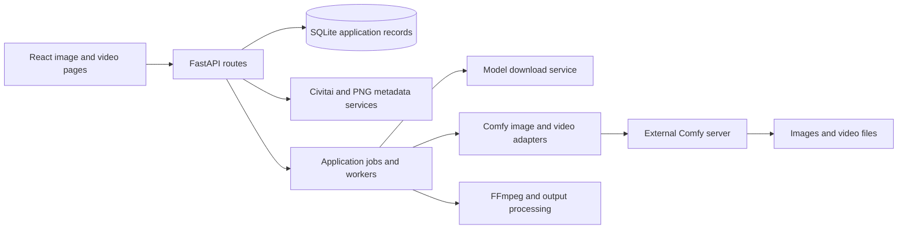

# Dreamtime: extraction assessment and competitive architecture comparison

**Baseline:** local Dreamtime commit `1129dfcca23afb59c59de48d97d92abbd31cd439`, captured 2026-09-12. The original working tree was clean. This document describes inspected code; it does not claim a fresh runtime test. The [Dreamtime dossier](projects/dreamtime.md) provides the full metrics and source map.

## 1. The application already contains the core ingredients

The actual stack is Vite/React 19/TypeScript with React Query and Zustand, plus Python FastAPI/Pydantic, SQLAlchemy/SQLite, jobs/workers, an external Comfy server, and FFmpeg-related media processing. Older Next.js descriptions should not drive an extraction plan.[^1]

The most relevant existing user surfaces are Imports, Import Detail, Generator, Video Generator, Models, and Model Hub. The music/storyboard application surrounds them, but image/model/video operations already have their own services and workflow adapters.[^2]

The diagram summarizes responsibility boundaries, not every route or asynchronous edge. The extraction should preserve useful boundaries while removing dependencies on unrelated project/music concepts.

## 2. Import and metadata recovery

| Existing source | Observed responsibility | Preserve | Improve for Remixfun |
|---|---|---|---|
| `api/services/civitai.py` | Civitai image/model metadata, resource IDs/weights, hash lookup, tRPC fallback | Provider-specific parsing and failure knowledge | Version provider adapters; preserve raw responses and acquisition source/time |
| `api/services/png_metadata.py` | A1111, Comfy, NovelAI, legacy Invoke parsing | Format recognition and reusable field parsing | Record unread/ambiguous fields; distinguish full graph from flattened approximation |
| `api/services/imports.py` | Resource availability against local/workspace models | Exact-version vs version-mismatch distinction | Resolve file variants/hashes and non-model execution requirements |
| `api/services/import_download.py` | Download source image and update import/job state | Source artifact acquisition | Preserve original bytes, source identity, and restart-safe file promotion |
| `web/src/pages/ImportDetail.tsx` | Metadata display, missing downloads, generator handoff | Focused source-first user flow | Immutable source/baseline/variant state rather than route parameters alone |

These are direct source findings.[^3][^4][^5][^6][^7]

The current availability vocabulary is a good foundation: an exact installed version is different from a different version of the same model; a downloadable version is different from an unidentified requirement. Extend that distinction rather than reducing the UI to a single green “ready” badge.

There are at least four identities to preserve separately: the Civitai **model**, its **version**, a particular downloadable **file**, and the **actual local bytes**. A version can offer more than one file. A renamed file can still be exact; a familiar filename can contain different bytes. Source metadata may identify only some of these.

Unbake and genrecord provide stronger explicit evidence/sufficiency concepts. CiviImport provides a narrowly focused resolver/graph builder. LoRA Manager provides richer recipe parsing/persistence/indexing. These are complementary comparisons, not reasons to throw away the existing Dreamtime import service.[^8]

## 3. Baseline reconstruction is currently a UI handoff

The Remix action restores prompts, dimensions, seed, steps, CFG, sampler/scheduler, clip skip, checkpoint, LoRAs, and embeddings into generator navigation state. That is useful and already close to the desired first interaction.[^7]

What it does not by itself establish is a durable baseline object with:

- the untouched original metadata and image;
- values actually recovered versus inferred defaults;
- exact resolved dependency hashes;
- a recorded engine/preset version;
- the submitted API graph and input media hashes;
- a repeatability observation and comparison to the source;
- a typed diff for each subsequent variant.

The import should survive changes to the generator UI. Reopening an old experiment should restore its own manifest, not silently apply today's default sampler, model, or prompt enhancement. Source evidence and editable working state should therefore be separate objects.

The closest competing structures are Unbake's record/manifest/sweep separation and Matrix's richer native project state. Invoke's metadata recall and persistent invocation workflows demonstrate how much information an application can retain for its own outputs. None removes the need to qualify incomplete foreign metadata.[^8][^9]

## 4. Model storage and downloads

Dreamtime's model service already has typed destinations, download jobs, progress, status recovery, and stored hashes. In the inspected path it removes prior partials, streams a fresh file, computes SHA-256, then records success. The computed digest is not checked against an expected upstream value in that completion path.[^10]

| Concern | Dreamtime today | Stronger reference | Proposed change |
|---|---|---|---|
| Exact version availability | Explicit state | CiviImport/LoRA Manager | Keep and extend to file/hash identity |
| Transfer integrity | Observed SHA-256 stored after transfer | CiviImport, SD.Next | Compare expected digest before marking ready |
| Interrupted transfer | Partial removed/restarted | SD.Next, broader download managers | Resume only against a compatible immutable resource/validator |
| Shared physical storage | Comfy directories plus workspace associations | Matrix/LoRA Manager | One blob inventory, many project references |
| Existing external library | Configured Comfy paths | Comfy extra paths/CiviImport | Index in place; avoid forced copies |
| Collection consistency | Database and files | LoRA Manager's cache/fingerprint invariants | Atomic state transitions and reconciliation |

These improvements are necessary to make “download/cache models easily” trustworthy at multi-gigabyte scale. A cache should also know which experiments still reference a file. “Unused by the currently open project” is not enough reason to remove it.

Expected hash, observed hash, transfer status, provider version/file identity, and user-selected substitution should be separate fields. A partial AutoV2 hash should be labeled as weaker evidence than a full SHA-256 match. A missing expected hash should yield an honest status rather than a fabricated verified result.

## 5. Video is valuable existing work, with model-specific constraints

The current video adapter contains model-template filling, chained segments, motion prompt selection, overlap trimming, latent/decoded concatenation choices, upscaling, interpolation, and a loop-closing segment. The workflow directory includes Wan 2.2 and LTX-2/LTX-2.3 families alongside image templates.[^11][^12]

Specific observed behavior matters:

- Wan 14B-oriented logic can add a segment from the final generated frame to the original input image.
- The inspected Wan 5B loop branch returns without that closing segment because its path lacks end-image support.
- LTX chaining uses different logic; the dispatcher explicitly describes it as image-mode chaining without loop support.
- Interpolation and upscaling are additional processing stages that affect output identity and should be preserved in the run record.
- A source comment describing a “seamless” loop is an implementation intention, not an independently measured visual result.

The initial Remixfun UI should expose first/last-frame, extension, and loop controls only when the selected preset supports them. If a requested operation is unavailable, explain the reason and offer another compatible preset. Do not silently drop the request and produce a normal clip.

Compare with WanGP for motion-oriented controls and queue portability; Swarm for generic Comfy graph generation; Invoke for its current Wan interpolation/extension catalog; and App Mode for presenting a prepared graph. Dreamtime's existing adapter remains the most direct implementation starting point.[^13]

## 6. Jobs, execution, and cancellation

Dreamtime has application jobs separate from Comfy prompts. Preserve this distinction: the user thinks in terms of an imported recipe or motion task, while the engine may execute one or several graphs. A durable mapping should connect application job ID, manifest hash, backend instance, Comfy prompt ID, outputs, and recovery state.[^14]

The current Comfy client uses the engine interrupt mechanism. If the user shares that engine with another frontend, cancellation can have wider consequences than the selected Remixfun job. Prefer a managed dedicated engine instance initially; external shared engines need explicit capability/ownership semantics.[^15]

Restart recovery should distinguish “not submitted,” “accepted by engine,” “running,” “output exists,” “failed,” and “unknown after connection loss.” Unbake's explicit uncertain-cell handling is a useful reference. Automatically resubmitting an unknown job can create duplicate generations and confuse which image was the baseline.[^8]

## 7. Portability is more than adding Tauri

`api/config.py` has absolute Linux defaults for Comfy and SQLite; frontend scripts invoke shell utilities. The original operational setup uses Linux service/development assumptions. These must be converted into an application environment model with portable paths and supervised subprocesses.[^1][^16]

The checked-in Comfy setup document records a January 13, 2026 commit, while the Dreamtime application snapshot is later and the public Comfy ecosystem is newer still. Treat that document as recorded setup information, not proof that every current template was tested against that exact commit. Build and validate a complete runtime profile before distributing it.[^17]

Desktop Release Kit proves a different boundary: signed application artifacts, updates, channels, relaunch, resources, and native sidecars. It does not supply a compatible Python/Torch/model environment. Comfy Desktop, Matrix, Krita's installer, and WanGP's launcher are more relevant references for that missing runtime-management layer.[^18]

## 8. Recommended extraction map

| Area | Decision | Reason |
|---|---|---|
| Civitai/PNG parsing | Retain and harden | Existing format/provider knowledge; add provenance and ambiguous-field reporting |
| Import detail interaction | Retain concept | Source-first entry point closely matches user intent |
| Image/video adapters and templates | Retain behind explicit interface | Largest task-specific investment; version and capability-test each preset |
| Model jobs/inventory | Refactor | Add verified transfers, shared blob identity, resumability, reconciliation |
| API types and client | Retain useful parts | One domain API for browser, CLI, and desktop |
| Job worker | Refactor | Manifest-backed identity and engine-aware recovery/cancel semantics |
| Workspace/project ownership | Simplify | Avoid requiring the music-video domain for a standalone generation |
| Music/lyrics/alignment/storyboard | Exclude from initial extraction | Not part of this product's first user job |
| Claude/account integrations | Exclude unless independently needed | Avoid carrying unrelated dependencies and setup into a local generation app |
| Linux paths/service scripts | Replace with portable runtime config | Required for Windows distribution |
| Desktop/update lifecycle | Adopt Release Kit contract | Existing infrastructure; new product-owned identity |

The proposed module boundaries in [ARCHITECTURE.md](ARCHITECTURE.md) are intentionally an extraction design, not an already-built repository layout.

## 9. Order of work after this research

1. Run the same supported fixture through Dreamtime and the direct competitors; keep outputs and manual-step notes.
2. Define one canonical record/manifest/diff representation and preserve original source evidence.
3. Extract a thin web/API image path with an external known-working Comfy instance.
4. Add exact dependency verification and controlled baseline/variant persistence.
5. Connect a selected variant to one tested motion preset with explicit capabilities.
6. Make that whole path survive restart and operate through a CLI.
7. Add a Windows runtime profile and Tauri lifecycle using Release Kit.
8. Test a Linux profile and a smaller Apple Silicon profile independently.

This order makes packaging serve a demonstrated workflow. No code extraction, dependency installation, or GPU validation has been done as part of the survey.

## Sources

[^1]: [Frontend manifest](../../references/dreamtime/web/package.json) and [Dreamtime dossier](projects/dreamtime.md), frozen at the baseline commit recorded above.
[^2]: [Pages](../../references/dreamtime/web/src/pages/) and [services](../../references/dreamtime/api/services/).
[^3]: [Civitai service](../../references/dreamtime/api/services/civitai.py).
[^4]: [PNG metadata parsers](../../references/dreamtime/api/services/png_metadata.py).
[^5]: [Import availability resolution](../../references/dreamtime/api/services/imports.py).
[^6]: [Source image downloads](../../references/dreamtime/api/services/import_download.py).
[^7]: [Import Detail](../../references/dreamtime/web/src/pages/ImportDetail.tsx).
[^8]: [Unbake](projects/unbake.md), [genrecord](projects/genrecord.md), [CiviImport](projects/civiimport.md), [LoRA Manager](projects/lora-manager.md).
[^9]: [Matrix](projects/stability-matrix.md) and [Invoke](projects/invokeai.md).
[^10]: [Model download service](../../references/dreamtime/api/services/model_download.py); comparison to [SD.Next](projects/sdnext.md).
[^11]: [Video adapter](../../references/dreamtime/api/services/comfy/video.py).
[^12]: [Workflow templates](../../references/dreamtime/api/workflows/).
[^13]: [WanGP](projects/wan2gp.md), [Swarm](projects/swarmui.md), [Invoke](projects/invokeai.md), [Comfy frontend](projects/comfy-frontend.md).
[^14]: [Worker](../../references/dreamtime/api/services/worker.py) and [job model](../../references/dreamtime/api/models/job.py).
[^15]: [Comfy client](../../references/dreamtime/api/services/comfy/client.py).
[^16]: [Configuration](../../references/dreamtime/api/config.py).
[^17]: [Recorded Comfy setup](../../references/dreamtime/COMFYUI.md).
[^18]: [Release Kit](projects/desktop-release-kit.md), [Comfy Desktop](projects/comfy-desktop.md), [Matrix](projects/stability-matrix.md), [Krita](projects/krita-ai-diffusion.md), [WanGP launcher](projects/wan2gp-desktop.md).
